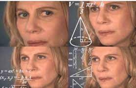

# Инструкция для работы с Git и удалёнными репозиториями

## **Что такое Git?**
**Git** - это одна из реализаций распределённых систем контроля версий, имеющая как и локальные, так и удалённые репозитории. Является самой популярной реализацией систем контроля версий в мире.
## **Подготовка репозитория**
Для создание репозитория необходимо выполнить команду ***git init***  в папке с репозиторием и у Вас создаться репозиторий (появится скрытая папка .git)

## **Создание коммитов**

* ### Git add
  Для добавления измений в коммит используется команда *git add*. Чтобы использовать команду ***git add*** напишите *git add <имя файла>*

* ### Просмотр состояния репозитория
  Для того, чтобы посмотреть состояние репозитория используется команда ***git status***. Для этого необходимо в папке с репозиторием написать *git status*, и Вы увидите были ли измения в файлах, или их не было.

* ### Создание коммитов
  Для того, чтобы создать коммит(сохранение) необходимо выполнить команду ***git commit***. Выполняется она так: *git commit -m "<сообщение к коммиту>*. Все файлы для коммита должны быть ***ДОБАВЛЕНЫ*** и сообщение к коммиту писать ***ОБЯЗАТЕЛЬНО***.

## **Перемещение между сохранениями**
Для того, чтобы перемещаться между коммитами, используется команда ***git checkout***. Используется она в папке с пепозиторием следующим образом: *git checkout <номер коммита>*

## **Журнал изменений**
Для того, чтобы посмотреть все сделанные изменения в репозитории, используется команда ***git log***. Для этого достаточно выполнить команду *git log* в папке с репозиторием

## **Ветки в Git**

* ### Создание ветки

  Для того, чтобы создать ветку, используется команда ***git branch***. Делается это следующим образом в папке с репозиторием: *git branch <название новой ветки>*

* ### Слияние веток

  Для того чтобы дабавить ветку в текущую ветку используется команда ***git merge <name branch>***

* ### Удаление веток
  Для удаления ветки ввести команду ***git branch -d 'name branch'***

# Makrdown инструкция

## Выделение текста

### *Курсив*

Чтобы выделить текст курсивом, необходимо обрамить его звездочкой

### **Полужирный**

Чтобы выделить текст полужирным шрифтом, необходимо обрамить его двумя звездочками 

### ***Полужирный курсив*** 

Для одновременного применения курсива и полужирного шрифта можно обрамить текст тремя звездочками или использовать альтернативный вариант обрамления - __*нижнее подчеркивание*__

## Списки

### Нумерованные списки

Для создания нумерованного списка перед каждым элементом необходимо указать цифру и точку:

1. Элемент 1
2. Элемент 2
3. Элемент 3

### Ненумерованые списки

Для создания ненумерованного списка перед каждым элементом необходимо проставить звездочку:

* Элемент 
* Элемент
* Элемент 

## Изображения 
Чтобы вставить изображение, необходимо ввести восклицательный знак, в квадратных скобках указать алтернативный текст, затем в круглых скобках указать адрес изображения

 
